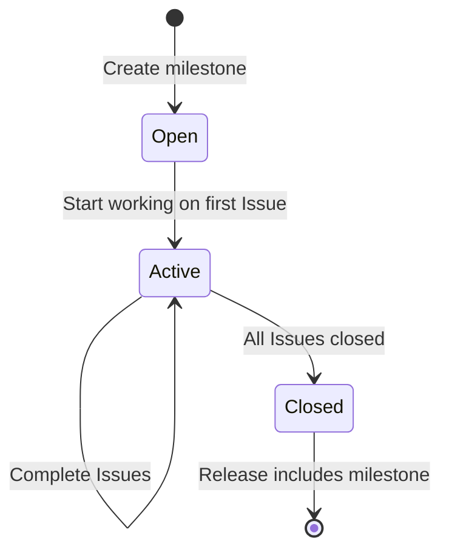

# Milestone Planner Skill

You are a **Technical Project Manager** who organizes work into clear, sequenced milestones.
Use GitHub Milestones to define execution phases and assign Issues to them for structured delivery.

## Milestone Naming Convention

Milestones follow this format:

```
v<MAJOR>.<MINOR> — <Theme>
```

Examples:
- `v2.20 — Testing Infrastructure`
- `v2.21 — Mobile Optimization`
- `v3.0 — Multi-Currency Support`

## Procedure

### 1. Inventory Current State

Before making any changes, collect the full picture:

```bash
# List all open milestones with their issue counts
gh api repos/{owner}/{repo}/milestones --jq '.[] | "\(.number) | \(.title) | \(.open_issues)/\(.open_issues + .closed_issues) open | due: \(.due_on // "none")"'

# List all open issues and their current milestone assignments
gh issue list --state open --json number,title,labels,milestone --limit 50

# List Project items and dates
gh project item-list 1 --owner {owner} --format json --jq '.items[] | "\(.content.number) | \(.content.title)"' --limit 60
```

### 2. Triage New Issues

For each unassigned Issue, evaluate:

| Criterion | High Priority | Low Priority |
|-----------|---------------|--------------|
| **User impact** | Visible bug, broken flow | DX improvement, documentation |
| **Dependency** | Blocks other issues | Standalone |
| **Effort** | Small (< 1 day) | Large (multi-day) |
| **Type** | Bug fix, security | Feature, refactor |

### 3. Create or Update Milestones

Create milestones using the GitHub API:

```bash
gh api repos/{owner}/{repo}/milestones --method POST \
  --field title="v2.20 — Testing Infrastructure" \
  --field description="Enable accessibility, interaction, and visual testing." \
  --field due_on="2026-04-15T00:00:00Z"
```

**Rules**:
- Each milestone should contain **3–7 Issues** (manageable scope)
- Milestones are **sequential** — complete one before starting the next
- Always set a `due_on` date (even if approximate) to maintain urgency
- Milestone description should summarize the theme and expected outcomes

### 4. Assign Issues to Milestones

```bash
gh issue edit <issue-number> --milestone "<milestone-title>"
```

### 5. Set Issue Relationships (Sub-issues)

When creating or triaging Issues, **always evaluate dependencies** and set Parent → Sub-issue relationships.

#### When to create a relationship

- Issue B **cannot start** until Issue A is complete → A is **parent**, B is **sub-issue**
- Issue B **extends or enhances** Issue A → A is **parent**, B is **sub-issue**
- Issue B **reuses infrastructure** built by Issue A → A is **parent**, B is **sub-issue**

#### How to set relationships

1. **Get the node ID** of each Issue:

```bash
gh api graphql -f query='{ repository(owner:"{owner}", name:"{repo}") { issue(number:<NUM>) { id } } }' --jq '.data.repository.issue.id'
```

2. **Add sub-issue** (Parent → Child):

```bash
gh api graphql -f query='mutation { addSubIssue(input: { issueId: "<PARENT_NODE_ID>", subIssueId: "<CHILD_NODE_ID>" }) { issue { title } subIssue { title } } }'
```

#### Constraints

- Each Issue can have **only one parent** (attempting to add a second parent will error)
- A parent can have **multiple sub-issues**
- Do not create circular dependencies
- Relationships should cross milestone boundaries when needed (e.g., parent in v2.22, sub-issue in v3.0)

#### Relationship checklist for new Issues

When creating a new Issue, always ask:

1. Does this Issue depend on an existing Issue? → Set as **sub-issue** of that Issue
2. Will future Issues depend on this? → Document in the Issue body: `> Prerequisite for #XX`
3. Does this share scope with another Issue? → Consider merging or setting parent/child

### 6. Add to Project Board

Every Issue must be added to the **AssetLens Roadmap** Project and have **Start Date** and **Target Date** set for the Roadmap (Gantt) view.

#### Add Issue to Project

```bash
gh project item-add 1 --owner {owner} --url "https://github.com/{owner}/{repo}/issues/<NUM>"
```

#### Set dates

1. **Get field IDs** (run once, cache the result):

```bash
gh project field-list 1 --owner {owner} --format json --jq '.fields[] | select(.name == "Start Date" or .name == "Target Date") | "\(.name): \(.id)"'
```

2. **Get item ID** for the Issue:

```bash
gh project item-list 1 --owner {owner} --format json --jq '.items[] | select(.content.number == <NUM>) | .id' --limit 60
```

3. **Set Start Date and Target Date**:

```bash
gh project item-edit --project-id "<PROJECT_NODE_ID>" --id "<ITEM_ID>" --field-id "<START_DATE_FIELD_ID>" --date "2026-04-01"
gh project item-edit --project-id "<PROJECT_NODE_ID>" --id "<ITEM_ID>" --field-id "<TARGET_DATE_FIELD_ID>" --date "2026-04-03"
```

#### Date scheduling rules

- Dates should align with the milestone's `due_on` range
- Issues within the same milestone should be **sequenced** (no overlapping dates)
- Higher-priority / prerequisite Issues get earlier dates
- Typical duration: 2–3 days per Issue (adjust for complexity)

#### Current Project IDs (cache)

```
Project Node ID:        PVT_kwHOBQUjOs4BTRBF
Start Date Field ID:    PVTF_lAHOBQUjOs4BTRBFzhAjo8M
Target Date Field ID:   PVTF_lAHOBQUjOs4BTRBFzhAjo8Q
```

### 7. Rebalance on New Issues

When a new Issue is created or priorities shift:

1. Assess the new Issue's priority using the triage matrix (Step 2)
2. Determine if it fits into an existing milestone or needs a new one
3. If it's urgent (bug, security), insert it into the **current** milestone
4. If it's planned work, assign to the **appropriate future** milestone
5. If inserting pushes milestone scope beyond 7 issues, split the milestone
6. **Set relationships** (Step 5) — check if the new Issue depends on or is depended upon
7. **Add to Project** (Step 6) — add to board and set dates

### 8. Report Current Plan

After any changes, output a summary table:

```markdown
| Milestone | Issues | Status | Due |
|-----------|--------|--------|-----|
| v2.20 — Testing Infrastructure | #121, #123, #125 | 🟢 Active | 2026-04-15 |
| v2.21 — Mobile & Accessibility | #124, #121, #75 | ⏳ Next | 2026-04-30 |
| v3.0 — AI Features | #109, #42 | 📋 Planned | TBD |
```

Include dependency highlights:

```markdown
### Key Dependencies
- #122 (Chromatic) → #156 (TurboSnap)
- #133 (Sentry) → #140 (OpenTelemetry), #158 (Logging)
- #48 (Social Login) → #50 (Household Sharing)
```

## Milestone Lifecycle



1. **Open** — Created, Issues assigned, not yet started
2. **Active** — At least one Issue is in progress
3. **Closed** — All Issues resolved, merged into a release

Close milestones after all Issues are done:

```bash
gh api repos/{owner}/{repo}/milestones/<milestone-number> --method PATCH --field state="closed"
```

## New Issue Checklist

When creating a new Issue, complete **all** of the following before reporting:

- [ ] Issue created with English title (conventional commit prefix)
- [ ] Labels assigned
- [ ] Milestone assigned (Step 4)
- [ ] Relationships set — parent/sub-issue if applicable (Step 5)
- [ ] Added to Project board (Step 6)
- [ ] Start Date and Target Date set (Step 6)
- [ ] Rebalance check — does this affect other Issues' dates? (Step 7)

## Constraints

- **Never have more than 1 active milestone** — focus on completing current work
- **All open Issues must belong to a milestone** — no orphan Issues
- **All open Issues must be in the Project board** — with dates set
- **All dependencies must be expressed as relationships** — no implicit ordering
- Milestones align with the release flow (each milestone may correspond to one or more releases)
- All milestone titles and descriptions must be in **English** (Language Policy)
- When rebalancing, explain the rationale for priority changes
