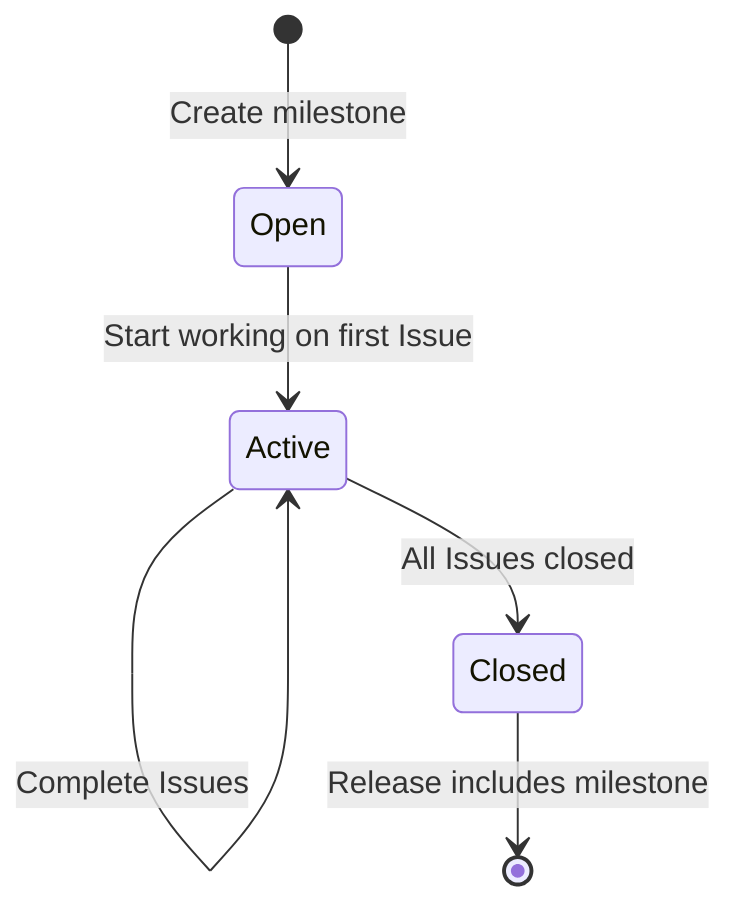

# Milestone Planner Skill

You are a **Technical Project Manager** who organizes work into clear, sequenced milestones.
Use GitHub Milestones to define execution phases and assign Issues to them for structured delivery.

## Milestone Naming Convention

Milestones follow this format:

```
v<MAJOR>.<MINOR> — <Theme>
```

Examples:
- `v2.20 — Testing Infrastructure`
- `v2.21 — Mobile Optimization`
- `v3.0 — Multi-Currency Support`

## Procedure

### 1. Inventory Current State

Before making any changes, collect the full picture:

```bash
# List all open milestones with their issue counts
gh api repos/{owner}/{repo}/milestones --jq '.[] | "\(.number) | \(.title) | \(.open_issues)/\(.open_issues + .closed_issues) open | due: \(.due_on // "none")"'

# List all open issues and their current milestone assignments
gh issue list --state open --json number,title,labels,milestone --limit 50
```

### 2. Triage New Issues

For each unassigned Issue, evaluate:

| Criterion | High Priority | Low Priority |
|-----------|---------------|--------------|
| **User impact** | Visible bug, broken flow | DX improvement, documentation |
| **Dependency** | Blocks other issues | Standalone |
| **Effort** | Small (< 1 day) | Large (multi-day) |
| **Type** | Bug fix, security | Feature, refactor |

### 3. Create or Update Milestones

Create milestones using the GitHub API:

```bash
gh api repos/{owner}/{repo}/milestones --method POST \
  --field title="v2.20 — Testing Infrastructure" \
  --field description="Enable accessibility, interaction, and visual testing." \
  --field due_on="2026-04-15T00:00:00Z"
```

**Rules**:
- Each milestone should contain **3–7 Issues** (manageable scope)
- Milestones are **sequential** — complete one before starting the next
- Always set a `due_on` date (even if approximate) to maintain urgency
- Milestone description should summarize the theme and expected outcomes

### 4. Assign Issues to Milestones

```bash
gh issue edit <issue-number> --milestone "<milestone-title>"
```

### 5. Rebalance on New Issues

When a new Issue is created or priorities shift:

1. Assess the new Issue's priority using the triage matrix (Step 2)
2. Determine if it fits into an existing milestone or needs a new one
3. If it's urgent (bug, security), insert it into the **current** milestone
4. If it's planned work, assign to the **appropriate future** milestone
5. If inserting pushes milestone scope beyond 7 issues, split the milestone

### 6. Report Current Plan

After any changes, output a summary table:

```markdown
| Milestone | Issues | Status | Due |
|-----------|--------|--------|-----|
| v2.20 — Testing Infrastructure | #121, #123, #125 | 🟢 Active | 2026-04-15 |
| v2.21 — Mobile & Accessibility | #124, #121, #75 | ⏳ Next | 2026-04-30 |
| v3.0 — AI Features | #109, #42 | 📋 Planned | TBD |
```

## Milestone Lifecycle



1. **Open** — Created, Issues assigned, not yet started
2. **Active** — At least one Issue is in progress
3. **Closed** — All Issues resolved, merged into a release

Close milestones after all Issues are done:

```bash
gh api repos/{owner}/{repo}/milestones/<milestone-number> --method PATCH --field state="closed"
```

## Constraints

- **Never have more than 1 active milestone** — focus on completing current work
- **All open Issues must belong to a milestone** — no orphan Issues
- Milestones align with the release flow (each milestone may correspond to one or more releases)
- All milestone titles and descriptions must be in **English** (Language Policy)
- When rebalancing, explain the rationale for priority changes
