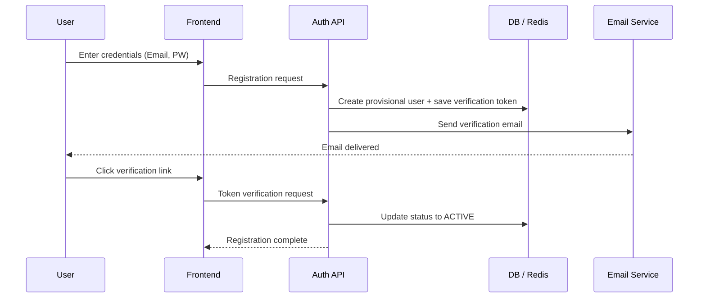

# PRD Quality Standard — Output Example

## User Input

"Users should be able to sign up and log in with email and password. Also need a password reset feature."

---

## 1. Overview

- **Background**: The service currently lacks a proprietary authentication foundation, making user identification impossible. A secure, extensible identity management system is needed.
- **Purpose**: Implement robust, standards-compliant email/password authentication to enable safe user onboarding.
- **Target Users**: All general users (PC/mobile browser).

## 2. Scope

- **In-Scope**:
  - Sign up: Validation, email verification, initial profile creation
  - Sign in: Session management, CSRF protection, rate limiting
  - Password reset: Token generation, email delivery, password update
  - Sign out: Session destruction, cookie clearing
- **Out-of-Scope**:
  - Social login (OAuth2/OpenID Connect)
  - Multi-factor authentication (MFA/2FA)
  - Admin user management dashboard (Phase 2)

## 3. Clarifying Questions

- [ ] Login session duration (default 2 weeks? Or expire when browser closes?)
- [ ] Password reset email sender address (e.g., `support@example.com`)
- [ ] Allow multiple accounts with the same email? (Current assumption: NO)

## 4. Functional Requirements

### 4.1 Feature List

| ID | Feature | Description |
|----|---------|-------------|
| FR-01 | Sign Up | Email/password registration with email verification |
| FR-02 | Sign In | Session-based authentication (cookie) |
| FR-03 | Sign Out | Active session destruction |
| FR-04 | Password Reset | Reset link via registered email |
| FR-05 | Account Lock | Temporary lock after consecutive login failures |

### 4.2 Authentication Flow



### 4.3 Detailed Specs

#### A. Sign Up

- **Input**:
  - `email`: Required. RFC 5322 compliant. Regex: `^[a-zA-Z0-9_.+-]+@[a-zA-Z0-9-]+\.[a-zA-Z0-9-.]+$`. Normalize to lowercase.
  - `password`: Required. 8-128 chars. Must contain 3+ of: uppercase, lowercase, digits, symbols.
- **Processing**:
  - Duplicate check: If already registered, follow 4.4 security spec.
  - Hashing: **Argon2id** with auto-generated salt.
  - Verification token: 64-char random string, stored in Redis with 24h TTL.

#### B. Sign In

- **Auth method**: Stateful session (cookie-based).
- **Cookie attributes**: `HttpOnly=true`, `Secure=true`, `SameSite=Lax`, `Path=/`, `Max-Age=1209600` (14 days).
- **Security response**: Failed auth returns `401 Unauthorized` with `{"code": "AUTH_FAILED", "message": "Invalid email or password"}`.

### 4.4 Edge Cases

| Case | Expected Behavior | Status Code |
|------|-------------------|-------------|
| Expired verification token | Display "Link expired. Please request a new one." | `410 Gone` |
| Re-register with existing email | Show "Verification email sent" + send different template informing already registered | `202 Accepted` |
| Rate limit exceeded | Block requests from same IP | `429 Too Many Requests` |
| Password too weak | Return validation errors with specific requirements not met | `422 Unprocessable Entity` |

## 5. Non-Functional Requirements

### 5.1 Security

- **Data protection**: DB connections over TLS, all communication HTTPS (TLS 1.3 recommended).
- **Security headers**: `X-Content-Type-Options: nosniff`, `X-Frame-Options: DENY`, `Content-Security-Policy: default-src 'self'`
- **Idempotency**: Client-side request ID to prevent duplicate registrations.

### 5.2 Performance

- **Response time**: Auth API latency (including hash computation) p95 **< 400ms**.
- **Throughput**: Handle 100 concurrent sign-up requests/sec.

### 5.3 Observability

- **Audit logs**: `timestamp`, `event_type`, `user_id_hash`, `ip_address_masked`, `user_agent`, `status`
- **Log triggers**: Login (success/failure), password change, lockout events.

## 6. Data Model

```sql
CREATE TABLE users (
    id UUID PRIMARY KEY DEFAULT gen_random_uuid(),
    email VARCHAR(254) UNIQUE NOT NULL,
    password_hash TEXT NOT NULL,
    status VARCHAR(20) NOT NULL DEFAULT 'PENDING', -- PENDING, ACTIVE, BLOCKED
    verified_at TIMESTAMPTZ,
    last_login_at TIMESTAMPTZ,
    failed_attempts INTEGER DEFAULT 0,
    lockout_until TIMESTAMPTZ,
    created_at TIMESTAMPTZ NOT NULL DEFAULT NOW(),
    updated_at TIMESTAMPTZ NOT NULL DEFAULT NOW()
);
```

## 7. Tech Stack

- **Backend Framework**: Next.js / TypeScript (App Router + Server Actions)
- **Auth Library**: better-auth
- **ORM/DB**: Drizzle ORM / Neon PostgreSQL
- **Email Service**: Resend

## 8. Risks & Mitigation

| Risk | Mitigation |
|------|-----------|
| Credential stuffing attacks | Account lockout (5 consecutive failures → 15 min lock) + CAPTCHA |
| Password database breach | Compare against Have I Been Pwned at registration (optional) |
| Email enumeration | Uniform response for existing/non-existing emails on registration |
