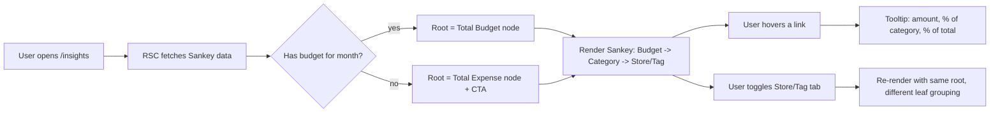
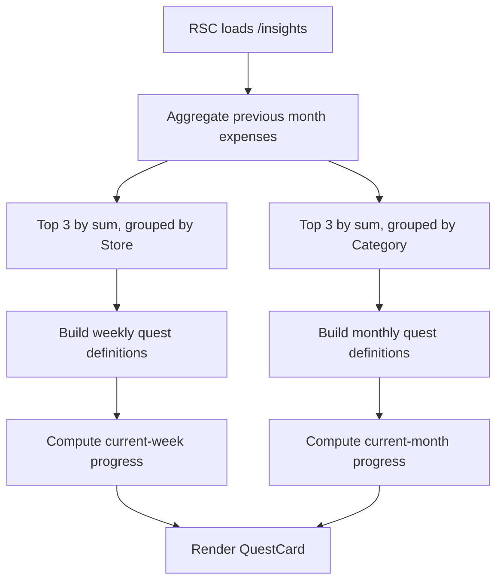

# Requirements: Money Flow Network Graph & Dynamic Quests

> **Status:** Draft · awaiting approval before implementation
> **Target route:** `/insights` (new, under `(main)` route group)
> **Schema changes:** **None** — read-only feature on the existing Drizzle schema

---

## 1. Overview

### 1.1 Background
`asset-lens` currently surfaces spending through tabular and chart-based summaries (`/dashboard`, `/report`). These views answer *"how much"* and *"when"* but not *"how does my money flow"* or *"what concrete behavior should I change next week."* This feature adds two complementary lenses on top of the same data:

1. **Money Flow Network Graph** — a Sankey diagram that traces yen from `[Budget]` → `[Category]` → `[Store / Tag]`, exposing the *relational* shape of spending that pie charts hide.
2. **Dynamic Quests** — auto-generated weekly/monthly behavioral challenges derived from the user's previous-month spending leaders, with live progress tracked from new `transaction` rows.

### 1.2 Goal
- Help users discover *which store/tag combinations* drain a category, not just the category total.
- Convert backward-looking analytics into forward-looking, concrete weekly goals without requiring the user to define them manually.

### 1.3 Target users
Existing authenticated users with at least one full month of transaction history. Users with insufficient history get a graceful empty state.

### 1.4 Non-goals
- No schema migrations (`db/schema.ts` is **read-only** for this feature).
- No external paid APIs, no LLM calls.
- No quest *persistence* across devices (see §3.1 Clarifying Questions).
- No editing of transactions from this view (read-only analytics surface).

---

## 2. Scope

### In scope
- New route `app/(main)/insights/page.tsx` (RSC).
- Two new server actions under `app/actions/analysis/`.
- Two new client feature components under `components/features/insights/`.
- Bottom-nav + header link to the new route.
- One new dependency: `d3-sankey` (MIT, ~7 KB gzip) + its types.
- Japanese UI copy, Tailwind styling matching existing Card-based widgets.

### Out of scope
- Persisting quest state (accepted / dismissed / completed) in DB.
- Editing budgets from this view.
- Tag-level budgets, store-level budgets.
- Mobile gesture-based Sankey panning beyond browser-native scroll.

---

## 3. Clarifying Questions

These need confirmation before code generation. Reasonable defaults are marked `[ASSUMED]` and used in the rest of this document.

| # | Question | `[ASSUMED]` default |
|---|---|---|
| Q1 | Should quest accept / dismiss state persist? Schema is locked, so options are: (a) stateless quests that always reflect last month's leaders; (b) `localStorage`-based dismissal; (c) future schema work. | **(a) stateless** for v1. Add `localStorage` dismissal in v1.1 if requested. |
| Q2 | Sankey nodes: should the third level be **Store**, **Tag**, or **both as toggleable views**? | **Both, toggle via tabs** (`Store` ↔ `Tag`). Same query, different leaf grouping. |
| Q3 | What anchors the leftmost node — total budget, or actual total expense for the month? | **Both rendered.** Single root node = `合計予算 (Total Budget)`. If no budget exists, fall back to "今月の支出合計 (Total Expense)" and show a CTA. |
| Q4 | Quest cadence: weekly only, monthly only, or both? | **Both.** Three quests generated per period, three cards per cadence section. |
| Q5 | Library lock-in: is adding `d3-sankey` acceptable, or must we reuse only `recharts` (v3 has no native Sankey)? | **Adding `d3-sankey` is acceptable** (MIT, free, ~7 KB, no peer-conflict). Fallback: `@visx/sankey` (also MIT). |
| Q6 | Time window for the Sankey: current month, last 30 days, or selectable? | **Current month** (selector mirrors `/dashboard` `MonthSelector`). |
| Q7 | Should quests count income transactions? | **No.** Only `isExpense = true`. |

---

## 4. Functional Requirements

### 4.1 Feature 1 — Money Flow Network Graph

#### 4.1.1 User flow


#### 4.1.2 Detailed spec

| Concern | Behavior |
|---|---|
| **Root node** | Per Q3: `Total Budget` if `budget.categoryId IS NULL` row exists for user, else `Total Expense (sum of transactions where isExpense=true and date in current month)`. |
| **Mid layer** | One node per `category` that has at least one expense transaction in the period. Node label = `category.name`, accent = `category.color`. |
| **Leaf layer** | Per Q2 toggle. **Store mode:** one node per distinct `transaction.storeName` (NULL grouped as `"未分類"`). **Tag mode:** one node per `tag` joined via `transactionTag`. Untagged transactions go into a synthetic `"タグなし"` node. |
| **Link width** | Proportional to summed amount in JPY for that flow. |
| **Tooltip on hover** | Shows: source name, target name, amount (`¥1,234`), % of source (e.g. `12% of 食費`), % of grand total. |
| **Empty state** | If period has zero expenses: render an `EmptyState` card with a link to `/transaction` and skip the Sankey. |
| **Insufficient nodes** | If only 1 category with 1 store, render the Sankey anyway (still valid 3-node graph). |
| **Long labels** | Truncate node labels to 14 chars with `…`; full name in `<title>` for accessibility. |
| **Color palette** | Reuse `category.color` for category nodes. Stores/tags inherit a desaturated tint of their parent category color. Links use the source node's color at 0.4 opacity. |
| **Responsiveness** | Min width 320 px. Below 640 px: render in vertical orientation (top → bottom). Use `useMediaQuery` or `matchMedia`. |
| **Accessibility** | SVG has `role="img"` + `aria-label`. Provide a `<details><summary>表形式で表示</summary>` fallback table containing the same flows for screen readers and `prefers-reduced-motion`. |

#### 4.1.3 Edge cases & error paths

| Case | Behavior |
|---|---|
| Transaction has `categoryId` but the category was deleted (FK orphan unlikely — `notNull` ref) | Group under `"不明"` node. |
| Transaction with `storeName = NULL` in Store mode | Group into `"未分類"` node. |
| Transaction with no rows in `transaction_tag` in Tag mode | Group into `"タグなし"` node. |
| Same transaction has N tags (M:N fan-out) | Distribute `amount / N` across each tag link to avoid double-counting. Document this rule in the tooltip footer ("複数タグの取引は均等按分"). |
| User has zero transactions for the month | Render the empty state from the table above. |
| Drizzle query failure | `createSafeAction` returns `{ success: false }`; component renders an error Card with a retry button. |

### 4.2 Feature 2 — Dynamic Quests

#### 4.2.1 Generation flow


#### 4.2.2 Quest definition rules

A quest is a deterministic struct derived from history; it has **no DB row**.

```ts
type Quest = {
  id: string;            // hash of (cadence, target_kind, target_id, period_start)
  cadence: "weekly" | "monthly";
  targetKind: "store" | "category";
  targetLabel: string;   // e.g. "セブンイレブン" or "食費"
  targetId: string | null; // store name (no FK) or categoryId
  thresholdJpy: number;  // budget for the quest period
  spentJpy: number;      // current spend within the period
  progressPct: number;   // round(spent / threshold * 100), capped at 200
  status: "on_track" | "warning" | "failed" | "completed";
  periodStart: Date;
  periodEnd: Date;
};
```

**Threshold calculation:**
- Weekly quest threshold = `round(prevMonthTotalForTarget / 4 * 0.7)` — encourage a 30 % cut versus the implicit weekly average.
- Monthly quest threshold = `round(prevMonthTotalForTarget * 0.85)` — encourage a 15 % cut.
- Minimum threshold floor: `¥1,000` (avoid degenerate `¥0` quests).

**Status thresholds:**

| `progressPct` (period not yet over) | Status |
|---|---|
| `< 70 %` | `on_track` (緑) |
| `70 – 100 %` | `warning` (橙) |
| `> 100 %` | `failed` (赤) |

If period is over and `progressPct ≤ 100`, status = `completed`.

#### 4.2.3 UI spec — `QuestCard`

| Element | Behavior |
|---|---|
| Header | Cadence badge (`今週` / `今月`) + targetKind icon (`Store` / `Tag` lucide icons). |
| Title | e.g. `セブンイレブンを今週¥3,000以下に` |
| Progress bar | Same component family as `BudgetProgress`, color from status. |
| Footer | `¥{spent} / ¥{threshold}` + `{daysRemaining}日残り` |
| Empty state | If user has < 30 days of history: show a single info Card "あと N 日でクエストが解放されます". |
| Live update | Card receives data via RSC. After a transaction is added on `/transaction`, `revalidatePath("/insights")` is called (already standard in `app/actions/transaction/*`). No client polling. |

#### 4.2.4 Edge cases

| Case | Behavior |
|---|---|
| Previous month has fewer than 3 distinct stores/categories | Generate as many quests as possible (1 or 2), don't pad. |
| Top store had `storeName = NULL` | Skip and take the next candidate. |
| User completes all quests | Show a `🎉` celebration Card above the list. |
| First-of-month boundary | `periodStart` / `periodEnd` use `date-fns` `startOfWeek` (`weekStartsOn: 1`, Monday) and `startOfMonth` to match existing convention. |

---

## 5. Component Hierarchy

```
app/
├─ (main)/
│  └─ insights/
│     ├─ page.tsx                        ← RSC, fetches both server actions in parallel
│     └─ loading.tsx                     ← Suspense skeleton (reuses page-skeletons)
│
components/features/insights/
├─ insights-view.tsx                     ← "use client", tab container (Sankey | Quests)
├─ money-flow/
│  ├─ money-flow-sankey.tsx              ← "use client", wires d3-sankey layout + interactivity
│  ├─ sankey-svg.tsx                     ← presentational SVG renderer
│  ├─ sankey-tooltip.tsx                 ← floating tooltip
│  ├─ sankey-table-fallback.tsx          ← a11y/no-JS table mirror
│  └─ leaf-mode-toggle.tsx               ← Store / Tag tab switch (radix Tabs)
└─ quests/
   ├─ quest-list.tsx                     ← server-rendered grid wrapper
   ├─ quest-card.tsx                     ← single card (presentational, server-safe)
   └─ quest-empty-state.tsx
```

**Reused from existing codebase:** `Card`, `CardHeader`, `Tabs`, `Skeleton` (`components/ui/`), `MonthSelector` (`components/features/dashboard/month-selector.tsx`), `cn()` (`lib/utils.ts`), `createSafeAction` / `createSafeQuery` (`lib/actions/safe-action.ts`), `BudgetProgress` styling tokens, color helpers from `lib/category-defaults.ts`.

**Bottom-nav:** insert a new entry between `取引` and `設定`:
```ts
{ href: "/insights", label: "分析", icon: Network }
```
(If 5 items make the FAB tight, demote `マイページ` from bottom nav and keep it in the header avatar menu.)

---

## 6. Data Aggregation — Drizzle Logic

Both server actions live under `app/actions/analysis/` and use `createSafeQuery` (no input args needed; both derive period from `Date.now()`).

### 6.1 `get-money-flow.ts`

**Signature:**
```ts
export type MoneyFlowNode = { id: string; label: string; level: 0 | 1 | 2; color?: string };
export type MoneyFlowLink = { source: string; target: string; value: number };

export type MoneyFlowResult = {
  month: string;                 // "yyyy-MM"
  rootKind: "budget" | "expense";
  rootAmount: number;
  storeView: { nodes: MoneyFlowNode[]; links: MoneyFlowLink[] };
  tagView:   { nodes: MoneyFlowNode[]; links: MoneyFlowLink[] };
};

export const getMoneyFlow = createSafeAction<string | undefined, MoneyFlowResult>(/* ... */);
```

**Aggregation steps:**

```ts
// (1) Period bounds
const month = input ?? format(new Date(), "yyyy-MM");
const start = startOfMonth(parse(month, "yyyy-MM", new Date()));
const end   = endOfMonth(start);

// (2) Pull rows in ONE pass via two parallel queries — keeps each query simple
//     and avoids a N×M cartesian when joining tags.

// 2a. Transaction × Category — used for store view AND for tag view base
const txRows = await db
  .select({
    txId:        transaction.id,
    amount:      transaction.amount,
    storeName:   transaction.storeName,
    categoryId:  category.id,
    categoryName:category.name,
    categoryColor: category.color,
  })
  .from(transaction)
  .innerJoin(category, eq(transaction.categoryId, category.id))
  .where(and(
    eq(transaction.userId, userId),
    eq(transaction.isExpense, true),
    gte(transaction.date, start),
    lte(transaction.date, end),
  ));

// 2b. Tag join (only the txIds that exist above)
const tagRows = await db
  .select({
    txId:    transactionTag.transactionId,
    tagId:   tag.id,
    tagName: tag.name,
    tagColor: tag.color,
  })
  .from(transactionTag)
  .innerJoin(tag, eq(transactionTag.tagId, tag.id))
  .where(inArray(transactionTag.transactionId, txRows.map(r => r.txId)));

// 2c. Budget root
const [overall] = await db
  .select({ amount: budget.amount })
  .from(budget)
  .where(and(eq(budget.userId, userId), isNull(budget.categoryId)))
  .limit(1);
```

**In-memory shaping:** done in plain TS to keep SQL simple and avoid Drizzle subquery complexity.

- Build `Map<categoryId, { name, color, total }>` from `txRows`.
- **Store view:** build `Map<categoryId, Map<storeKey, total>>` where `storeKey = storeName ?? "__null__"`. Emit one `MoneyFlowLink` per (root → category) and (category → store).
- **Tag view:** build `Map<txId, Tag[]>` from `tagRows`. For each transaction:
  - If `tags.length === 0`: assign full amount to a synthetic `"untagged"` leaf under that category.
  - Else: assign `amount / tags.length` to each tag leaf. Documented in §4.1.3.
- **Root level:** if `overall?.amount` exists, root value = `overall.amount`, `rootKind = "budget"`. Else `rootKind = "expense"` and root value = sum of all `txRows.amount`.

**Indexes leveraged:**
- `transactions_userId_date_idx` for the `WHERE userId = ? AND date BETWEEN ? AND ?` predicate.
- `transaction_tag_tag_idx` and PK on `transaction_tag` for the IN-list lookup.
- `budget_userId_categoryId_unique` for the overall-budget point lookup.

**Complexity:** O(T) where T = transactions in month. For an active user (~300 tx/month) this is sub-50 ms p95 on Vercel Postgres warm.

### 6.2 `get-dynamic-quests.ts`

**Signature:**
```ts
export type Quest = { /* see §4.2.2 */ };
export type DynamicQuestsResult = {
  weekly: Quest[];
  monthly: Quest[];
  insufficientHistory: boolean; // true if < 30 days of data
};
export const getDynamicQuests = createSafeQuery<DynamicQuestsResult>(/* ... */);
```

**Aggregation steps:**

```ts
const now = new Date();
const prevMonthStart = startOfMonth(subMonths(now, 1));
const prevMonthEnd   = endOfMonth(prevMonthStart);
const weekStart      = startOfWeek(now, { weekStartsOn: 1 });
const weekEnd        = endOfWeek(now, { weekStartsOn: 1 });
const monthStart     = startOfMonth(now);
const monthEnd       = endOfMonth(now);

// (1) Top stores last month — SQL aggregation pushed down
const topStoresPrev = await db
  .select({
    storeName: transaction.storeName,
    total:     sql<number>`SUM(${transaction.amount})`.as("total"),
  })
  .from(transaction)
  .where(and(
    eq(transaction.userId, userId),
    eq(transaction.isExpense, true),
    isNotNull(transaction.storeName),
    gte(transaction.date, prevMonthStart),
    lte(transaction.date, prevMonthEnd),
  ))
  .groupBy(transaction.storeName)
  .orderBy(desc(sql`total`))
  .limit(3);

// (2) Top categories last month
const topCatsPrev = await db
  .select({
    categoryId:   category.id,
    categoryName: category.name,
    total:        sql<number>`SUM(${transaction.amount})`.as("total"),
  })
  .from(transaction)
  .innerJoin(category, eq(transaction.categoryId, category.id))
  .where(and(
    eq(transaction.userId, userId),
    eq(transaction.isExpense, true),
    gte(transaction.date, prevMonthStart),
    lte(transaction.date, prevMonthEnd),
  ))
  .groupBy(category.id, category.name)
  .orderBy(desc(sql`total`))
  .limit(3);

// (3) Current-period spend per top target — two more aggregated queries with
//     IN-list filters (storeName IN (...) and categoryId IN (...))
//     for week and month respectively.
```

Each Quest's `spentJpy` is then a simple `Map.get` against the result of step 3. Quest construction (threshold + status) is pure TS — see §4.2.2.

**Indexes leveraged:**
- `transactions_userId_storeName_idx` for store grouping.
- `transactions_categoryId_idx` + `transactions_userId_date_idx` for category grouping.

---

## 7. Non-Functional Requirements

| Concern | Target |
|---|---|
| **RSC TTFB on `/insights`** | p95 < 600 ms warm, < 1.2 s cold (Vercel Postgres free tier baseline). |
| **Server action latency** | `getMoneyFlow` p95 < 250 ms for ≤ 1,000 tx; `getDynamicQuests` p95 < 200 ms (5 SQL hits, all aggregated). |
| **Bundle impact** | New client JS ≤ 30 KB gzip total. `d3-sankey` (~7 KB) + `d3-shape` (already transitive via `recharts`). Lazy-load `MoneyFlowSankey` via `next/dynamic` to keep `/insights` initial JS tiny. |
| **A11y** | WCAG 2.1 AA: SVG with `role="img"` + descriptive `aria-label`; table fallback mirrors links; quest progress bars expose `aria-valuenow` / `aria-valuemax`; keyboard-focusable Sankey nodes (`tabIndex={0}` + `Enter` to pin tooltip). |
| **i18n** | All UI copy in Japanese, consistent with current app. Numbers via `Intl.NumberFormat("ja-JP")` (already used). |
| **Logging** | Both server actions go through `createSafeAction` → `log.info("Action completed", …)` and Sentry capture on failure. |
| **Rate limit** | `rateLimit: "read"` on both actions (existing default). |
| **`prefers-reduced-motion`** | Disable Sankey link transitions and progress-bar fill animations. |
| **SSR safety** | `d3-sankey` is pure JS — runs in RSC layout step. Only the *interactive* tooltip and tab toggle need `"use client"`. |

---

## 8. Tech Stack

| Layer | Choice | Rationale |
|---|---|---|
| Framework | Next.js 16 App Router (existing) | — |
| Data | `drizzle-orm`, `@vercel/postgres` (existing) | — |
| Auth wrapper | `createSafeAction` / `createSafeQuery` (existing) | Consistent error/logging surface. |
| Sankey layout | **`d3-sankey` ^0.12** + `@types/d3-sankey` (new) | Smallest free option; MIT; no React peer deps. |
| Custom rendering | Plain SVG with React 19 components | No additional charting wrapper; full control over theme tokens. |
| Tabs | `@radix-ui/react-tabs` (existing) | — |
| Icons | `lucide-react` (existing) — `Network`, `Trophy`, `Target`, `Store`, `Tag` | — |
| Date math | `date-fns` (existing) | `startOfWeek({ weekStartsOn: 1 })`, `subMonths`, etc. |
| Tests | `vitest` (existing) | Unit tests for the aggregation helpers (deterministic input → output). |

**Rejected alternatives:**
- `recharts` Sankey — not present in v3.
- `@nivo/sankey` — pulls a ~140 KB tree of `@nivo/core` peers; overkill.
- `@visx/sankey` — viable fallback; ~30 KB, more deps than `d3-sankey`. Hold in reserve if `d3-sankey` typings cause friction.

---

## 9. Risks & Mitigation

| # | Risk | Likelihood | Impact | Mitigation |
|---|---|---|---|---|
| R1 | Tag M:N fan-out distorts the Sankey if a transaction has many tags | Medium | High (visual lie) | Equal-split `amount / tags.length` rule (§4.1.3); footnote in tooltip; unit-tested. |
| R2 | Stateless quests feel "lossy" — user can't dismiss an unwanted quest | Medium | Medium | Track Q1 with user; add `localStorage`-based dismissal in v1.1 if required, gated behind a single `useDismissedQuests()` hook so swap to DB later is one file. |
| R3 | `d3-sankey` types incomplete or break on Next 16 RSC build | Low | Medium | Wrap layout call in a tiny `lib/sankey/layout.ts` adapter so swap to `@visx/sankey` is local. |
| R4 | Users with sparse data see a near-empty graph | High | Low | Empty state + insufficient-history banner in `quest-empty-state.tsx`. |
| R5 | Performance regression for users with > 5,000 tx/month | Low | Medium | Aggregations are SQL-side `SUM/GROUP BY`; only the Sankey's tag join pulls raw rows. Add `LIMIT 5000` guard with a "data clipped" notice. |
| R6 | Mobile Sankey unreadable in landscape Sankey at 320 px | Medium | Medium | Vertical orientation breakpoint at 640 px; pinch-zoom via native browser since SVG has explicit viewBox. |
| R7 | Quest threshold floor (¥1,000) is culturally arbitrary | Low | Low | Surface as constant in `lib/quests/config.ts` for easy tuning; document. |

---

## 10. Acceptance Criteria

A reviewer can mark this feature done when **all** of the following hold:

- [ ] `/insights` loads as an RSC page; no client-only data fetching introduced.
- [ ] `getMoneyFlow` and `getDynamicQuests` are wrapped with `createSafeAction` / `createSafeQuery` and return strictly typed results.
- [ ] Sankey renders Budget → Category → Store and Budget → Category → Tag, switchable via tabs, with hover tooltips showing exact yen + percent.
- [ ] M:N tag rule is unit-tested with at least one fixture where a transaction has 2 tags.
- [ ] Up to 3 weekly + 3 monthly quests render based on the previous month's top stores and categories; each card shows live progress against the current period.
- [ ] No changes to `db/schema.ts` or `drizzle/` migrations.
- [ ] Biome (`npx biome check . --diagnostic-level=error`) and Vitest (`npm test`) both pass.
- [ ] Bottom-nav and header link to `/insights`; route is gated by `requireAuth` via the existing `(main)` layout.
- [ ] Storybook stories exist for `QuestCard` (4 status states) and `SankeySvg` (empty / typical / single-category fixtures).
- [ ] Lighthouse a11y score for `/insights` ≥ 95.

---

## 11. Implementation Plan (post-approval)

Single feature branch `feature/money-flow-insights` off `develop`, split into focused commits per branching policy:

1. `chore: add d3-sankey dependency`
2. `feat: add getMoneyFlow server action`
3. `feat: add getDynamicQuests server action`
4. `test: cover money-flow tag fan-out and quest threshold edge cases`
5. `feat: add money-flow Sankey components`
6. `feat: add dynamic quest cards`
7. `feat: wire /insights route and bottom-nav entry`
8. `docs: storybook stories for new components`

PR target: `develop`. CHANGELOG entry under `Unreleased → Added`.

---

**Awaiting your approval (or revisions) on the clarifying questions in §3 and the overall plan before any code is generated.**
