# Database ER Diagram

> Auto-generated from `db/schema.ts` by `scripts/generate-dbml.ts`.
> **Do not edit manually** — changes will be overwritten.
>
> For an interactive view, import [`docs/schema.dbml`](./schema.dbml) into [dbdiagram.io](https://dbdiagram.io/d).

```mermaid
erDiagram
    account }o--|| user : "user_id"
    budget ||--|| user : "user_id"
    budget ||--|| category : "category_id"
    dismissed_duplicate }o--|| user : "user_id"
    passkey }o--|| user : "user_id"
    savings_goal }o--|| user : "user_id"
    session }o--|| user : "user_id"
    store }o--|| user : "user_id"
    subscription }o--|| user : "user_id"
    tag }o--|| user : "user_id"
    transaction }o--|| category : "category_id"
    transaction_tag ||--|| transaction : "transaction_id"
    transaction_tag }o--|| tag : "tag_id"
    transaction_template }o--|| user : "user_id"

    account {
        text id PK
        text account_id
        text provider_id
        text user_id FK
        text access_token
        text refresh_token
        text id_token
        timestamp access_token_expires_at
        timestamp refresh_token_expires_at
        text scope
        text password
        timestamp created_at
        timestamp updated_at
    }
    budget {
        uuid id PK
        text user_id FK
        uuid category_id FK
        integer amount
        timestamp created_at
        timestamp updated_at
    }
    category {
        uuid id PK
        text name
        text slug
        text type
        text icon
        text color
        text user_id
        integer sort_order
        timestamp created_at
        timestamp updated_at
    }
    contact_inquiry {
        uuid id PK
        text name
        text email
        text category
        text message
        text status
        text note
        timestamp created_at
        timestamp updated_at
    }
    dismissed_duplicate {
        uuid id PK
        text user_id FK
        uuid transaction_id_1
        uuid transaction_id_2
        timestamp created_at
    }
    inquiry_reply {
        uuid id PK
        uuid inquiry_id
        text direction
        text sender_email
        text subject
        text body
        timestamp created_at
    }
    passkey {
        text id PK
        text name
        text public_key
        text user_id FK
        text credential_id
        integer counter
        text device_type
        boolean backed_up
        text transports
        timestamp created_at
        text aaguid
    }
    savings_goal {
        uuid id PK
        text user_id FK
        text name
        integer target_amount
        integer current_amount
        date deadline
        text icon
        text color
        text status
        timestamp created_at
        timestamp updated_at
    }
    session {
        text id PK
        timestamp expires_at
        text token
        timestamp created_at
        timestamp updated_at
        text ip_address
        text user_agent
        text user_id FK
    }
    store {
        uuid id PK
        text user_id FK
        text name
        timestamp created_at
        timestamp updated_at
    }
    subscription {
        text id PK
        text user_id FK
        text name
        integer amount
        text currency
        text billing_cycle
        timestamp next_payment_date
        text category
        text status
        timestamp created_at
        timestamp updated_at
    }
    tag {
        uuid id PK
        text user_id FK
        text name
        text color
        timestamp created_at
    }
    transaction {
        uuid id PK
        text user_id
        integer amount
        text description
        text store_name
        date date
        boolean is_expense
        uuid category_id FK
        timestamp created_at
        timestamp updated_at
    }
    transaction_tag {
        uuid transaction_id FK
        uuid tag_id FK
    }
    transaction_template {
        uuid id PK
        text user_id FK
        text name
        integer amount
        text description
        text store_name
        uuid category_id
        boolean is_expense
        integer usage_count
        timestamp created_at
        timestamp updated_at
    }
    user {
        text id PK
        text name
        text email
        boolean email_verified
        text image
        timestamp created_at
        timestamp updated_at
    }
    verification {
        text id PK
        text identifier
        text value
        timestamp expires_at
        timestamp created_at
        timestamp updated_at
    }
```

---

*Last updated: 2026-04-26*
